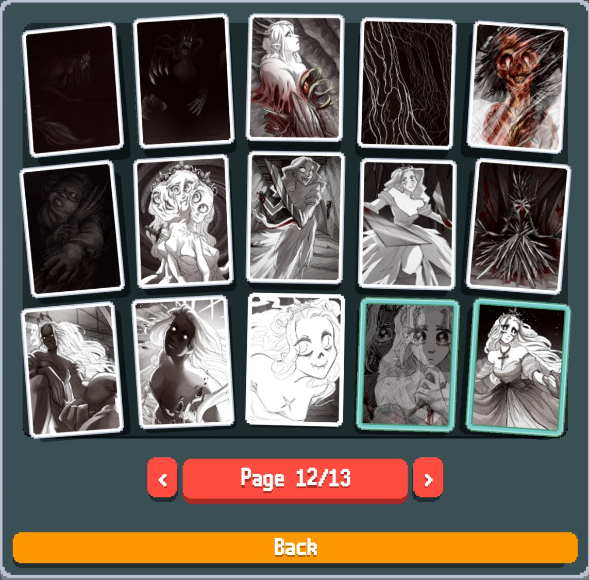

## Content
This Slay The Princess themed Balatro mod adds 31 Jokers, some of which introduce new mechanics, a new deck, and new Booster Packs!

<table>
  <tr>
    <td></td>
    <td></td>
  </tr>
  <tr>
    <td valign="top"></td>
    <td valign="top">
      <br>
      
    </td>
  </tr>
</table>


I have some ideas to expand this mod with (Vouchers, a new Consumable type, The Long Quiet Deck, and several more...), but no promises as life can get in the way.

## Installation
- Requires [Steamodded](https://github.com/Steamodded/smods/releases/latest), install the latest version if you haven't already
- Download the [latest release](https://github.com/Kastamera/SlayThePrincess/releases) of Slay the Princess - A Balatro Mod
- Extract the downloaded mod and move it to the Mods folder (on Windows %appdata%/Balatro/Mods)
- The structure should look like the following:
```text
%APPDATA%/
└─ Balatro/
   └─ Mods/
      └─ SlayThePrincess/
         └─ .github/
         └─ assets/
         └─ .gitattributes
         └─ README.md
         └─ SlayThePrincess.lua
```
